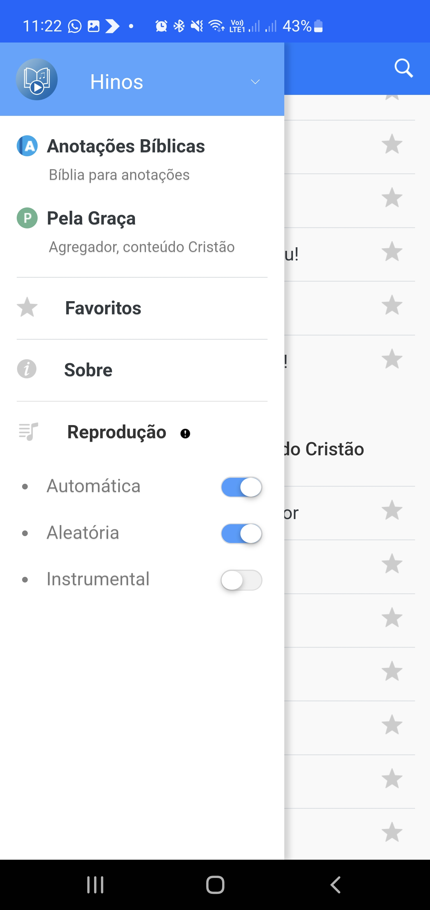

# Hinário - 1.0.0

O Hinário é um aplicativo criado para auxiliar os irmãos da assembléia a cantar, buscar e organizar os hínos como favoritos. No Hinário é possível selecionar entre hínos, salmos e hínos para crianças, todos com letras e alguns com o áudio, sendo possível escutar os hínos em ordem aleatória ou sequêncial, com voz ou apenas instrumental.

## Funcionalidades e recursos

- Sistema de busca para verso, número e título
- Opção de aumentar e diminuir o tamanho das letras
- 3 Opções de hínos, que são:
    - Hínos
    - Salmos
    - Hínos para crianças
- Áudio dos hínos
- Opção de escutar os hínos em forma sequencial ou aleatória.
- Lista de hínos favoritos

## Prints da tela

## Características técnicas

- Aplicativo Phonegap
- Banco de dados relacional - SQLite
- Versão: 1.0.0